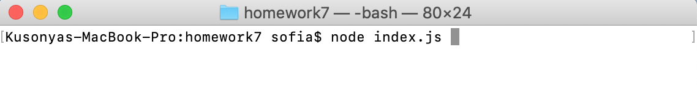
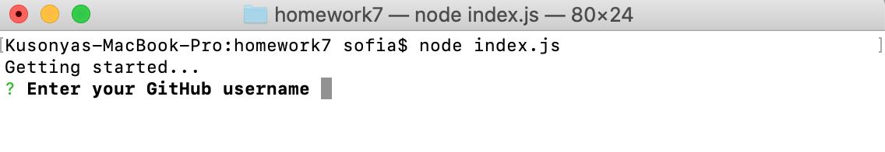
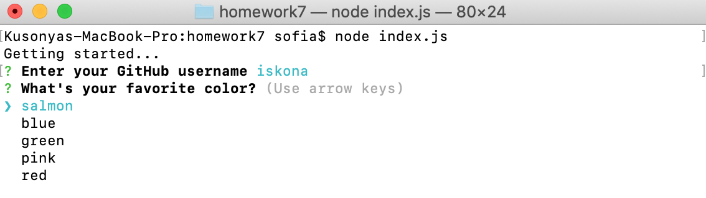
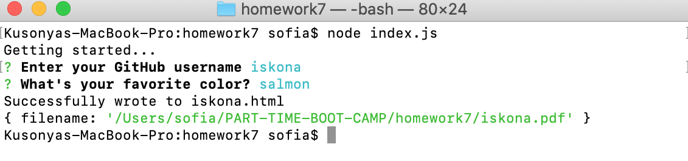

# Developer Profile Generator


## Built with

* 3rd-party API 
* Bootstrap
* JavaScript
* Node
    * inquirer
    * html-pdf
    * axios

## Overview

This is a command-line application that dynamically generates a PDF profile from a GitHub username. The application is invoked with the following command: "node index.js".

The user is prompted for a GitHub username and a favorite color, which will be used as the background color for cards.

The PDF will be populated with the following:

* Profile image
* User name
* Links to the following:
    * User location via Google Maps
    * User GitHub profile
    * User blog
* User bio
* Number of public repositories
* Number of followers
* Number of GitHub stars
* Number of users following

## Purpose
```
Given the developer has a GitHub profile,
When promped for their username and favorite color,
Then a PDF profile is generated.
```

## Screenshots
### Launch


### Name prompt


### Color prompt


### Result


### HTML version
